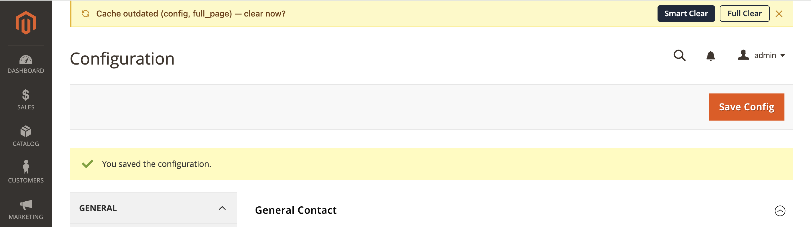
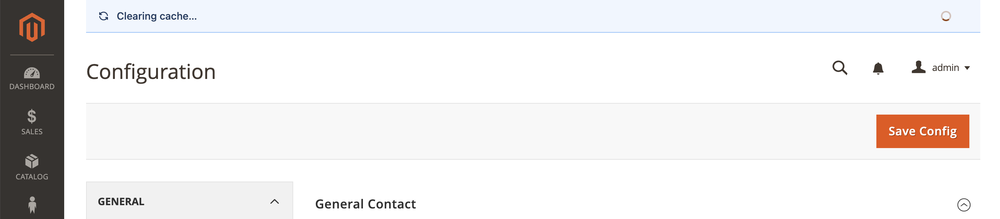
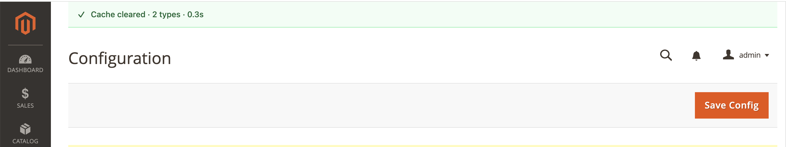
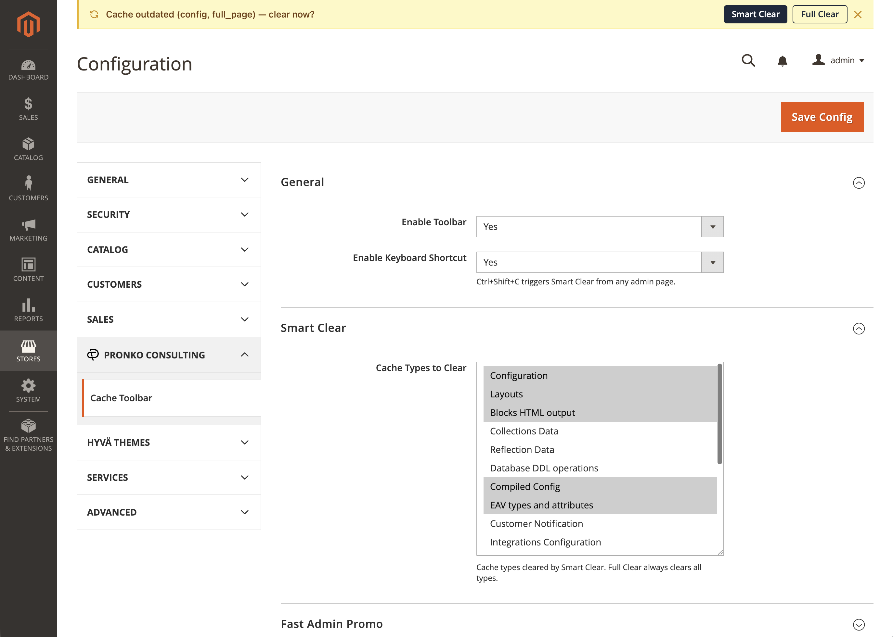

# ⚡ Cache Toolbar for Magento 2

Clear cache in one click — from any page, without navigating to System → Cache Management.

[](https://packagist.org/packages/pronko/magento2-cache-toolbar)
[](https://packagist.org/packages/pronko/magento2-cache-toolbar)
[](https://www.php.net)
[](https://github.com/magento/magento2)
[](https://mage-os.org)
[](LICENSE)

---

## The problem

You save a config. Magento says "cache invalidated". You navigate to System → Cache Management. Select cache types. Click Flush. Go back to where you were.

**That's 6 steps for something that should take 1.**

## The solution

A smart status bar appears automatically when your cache is outdated — with a single **Smart Clear** button that clears the right types instantly, without leaving the page.



Clearing cache...



Cache cleared...




Magento's default "cache invalidated" system message is suppressed — no duplicate warnings.


---

## Features

- **Smart Clear** — clears only the cache types that are actually invalidated, from your configured list
- **Full Clear** — clears all cache types and flushes the cache pool when you need a clean slate
- **Zero-delay detection** — cache status is checked server-side on every page load, bar renders immediately with no AJAX flicker
- **Suppresses Magento's default warning** — no more duplicate "Cache Types are invalidated" messages
- **Keyboard shortcut** — `Ctrl+Shift+C` triggers Smart Clear from anywhere in the admin
- **Auto-dismiss** — success message disappears after 3 seconds, stays out of your way
- **Configurable** — choose which cache types Smart Clear targets via Stores → Configuration
- **ACL-aware** — toolbar only renders for admin users with cache clear permission

---

## Installation

```bash
composer require pronko/magento2-cache-toolbar
bin/magento module:enable Pronko_CacheToolbar
bin/magento setup:upgrade
```

---

## Configuration

**Stores → Configuration → Pronko → Cache Toolbar**

| Setting | Default | Description |
|---|---|---|
| Enable Toolbar | Yes | Show/hide the toolbar |
| Keyboard Shortcut | Yes | Enable `Ctrl+Shift+C` |
| Smart Clear Types | 7 types | Which cache types Smart Clear targets |
| Show Fast Admin Promo | Yes | Promotional banner (disable for client deployments) |

Configuration settings:



---

## Compatibility

| Platform | Version |
|---|---|
| Magento Open Source | 2.4.4 — 2.4.x |
| Adobe Commerce | 2.4.4 — 2.4.x |
| MageOS | 2.4.6+ |
| PHP | 8.2, 8.3, 8.4, 8.5 |

---

## Smart Clear vs Full Clear

| | Smart Clear | Full Clear |
|---|---|---|
| Which types | Invalidated types from your configured list | All registered cache types |
| Cache pool flush | No | Yes |
| CLI equivalent | `cache:clean config full_page` | `cache:flush` |
| Use case | After a config save or deploy | When something is deeply wrong |

---

## Promotional banner

This module ships with an optional promotional banner for [Fast Admin](https://pronkoconsulting.com/fast-admin) — a faster Magento admin interface by Pronko Consulting.

The banner is **fully optional** — disable it at:
Stores → Configuration → Pronko → Cache Toolbar → Show Promo Banner → **No**


The banner is a static HTML element with a link. No analytics, no tracking, no external requests.

---

## Requirements

- PHP 8.2+
- Magento 2.4.4+ / MageOS 2.4.6+

---

## Contributing

Pull requests are welcome. For major changes, please open an issue first to discuss what you'd like to change.

---

## License

[Open Software License 3.0 (OSL-3.0)](LICENSE)

---

<p align="center">
  Tired of slow Magento admin? &nbsp;
  <a href="https://www.pronkoconsulting.com/fast-admin?utm_source=cache-toolbar&utm_medium=readme&utm_campaign=oss-module">
    <strong>⚡ Fast Admin loads orders in 0.3s →</strong>
  </a>
</p>
